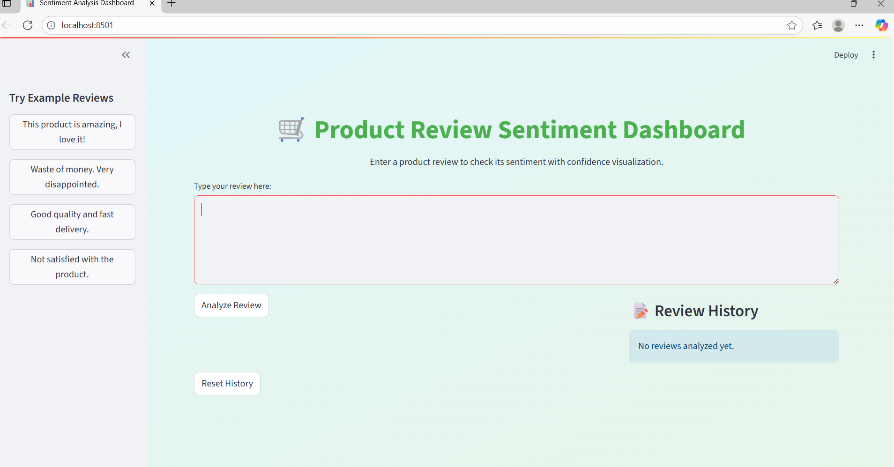
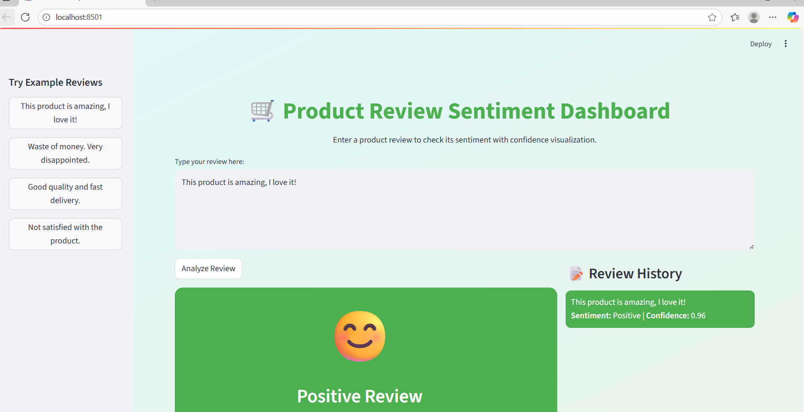
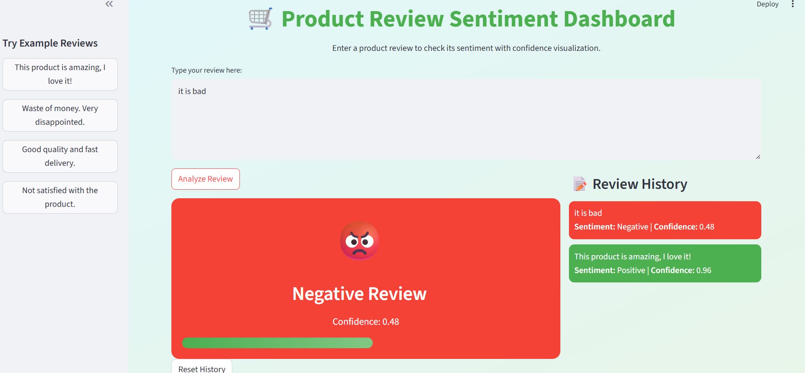

# 🛒 Product Review Sentiment Analysis Dashboard  

This project is a **web app** that checks if a product review is **Positive 😊 or Negative 😡**.  
It uses **Machine Learning (LSTM model)** and is built with **Streamlit** so anyone can use it in a web browser.  

---

## Features  
- Type or paste a product review and check its **sentiment**  
- Shows **Positive / Negative** with confidence score  
- Example reviews to test quickly  
- Simple, clean, and interactive dashboard  
- Works in the browser — no coding needed!  

---

## Screenshots

### Home Page


### Positive Sentiment Example


### Negative Sentiment Example

 

---

## How It Works (Simple Steps)  

1. **User enters a review** (like *“This product is amazing”*).  
2. The text is cleaned (remove stopwords, punctuation, etc.).  
3. The review is converted into numbers using a **tokenizer**.  
4. A trained **LSTM model** checks the meaning of the words.  
5. The app shows if the review is **Positive** or **Negative**.  

---

## Tech Stack  

- **Python**   
- **TensorFlow / Keras** → Deep Learning Model (LSTM)  
- **NLTK** → Text preprocessing (stopwords, stemming)  
- **Streamlit** → Web App & Deployment  
- **NumPy** → Numerical operations  

---

## How to Run Locally  

1. Clone the repo:  
   ```bash
   git clone https://github.com/your-username/sentiment-analysis-dashboard.git
   cd sentiment-analysis-dashboard
 
2. Install dependencies
   ```bash
   pip install -r requirements.txt

3. Run the Streamlit app
   ```bash
   streamlit run app.py

4. Open in your browser
   http://localhost:8501